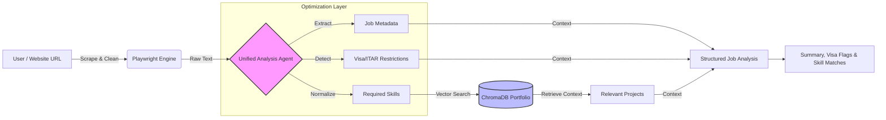

# GenAI Job Analyzer & Cold Email Agent

[](https://job-post-analyzer.streamlit.app/)


**A RAG-based AI agent that scrapes job descriptions, detects visa restrictions, performs bi-directional skill matching, and generates hyper-personalized cold emails.**

🔗 **Live Demo:** [https://job-post-analyzer.streamlit.app/](https://job-post-analyzer.streamlit.app/)

---

## Architecture

The architecture is optimized to reduce LLM token usage by **50% (4k → 2k tokens per run)** by consolidating extraction, visa analysis, and skill normalization into a unified prompt strategy.



## Key Features

* **Intelligent Scraping:** Uses `Playwright` to handle single-page application (SPA) career sites (e.g., Workday, Greenhouse) that standard scrapers miss.
* **Visa & Legal Analysis:** Flags restrictive terms like *"U.S. Citizen Only"*, *"Security Clearance"*, or *"ITAR compliance"* to save time on ineligible applications.
* **Token Optimization:** Constructed a consolidated prompt pipeline that performs extraction and analysis in a single pass, reducing average token consumption by 50% per request.
* **Semantic Portfolio Matching:** Uses **ChromaDB** to match extracted job skills against a candidate's portfolio (Currently set to mine), retrieving the most relevant projects to cite as evidence in the email.
* (In progress) **Context-Aware Outreach:** Generates professional cold emails tailored specifically to the hiring manager and the role's tech stack.

---

## Tech Stack

* **Frontend:** Streamlit
* **LLM:** LangChain
* **Inference Engine:** Groq (Llama-3.3-70b-Versatile)
* **Vector Database:** ChromaDB
* **Web Scraping:** Playwright + BeautifulSoup4
* **Deployment:** Streamlit Community Cloud

---

## Local Setup

If you want to run this locally:

**1. Clone the repository**
```bash
git clone [https://github.com/yourusername/genai-job-analyzer.git](https://github.com/yourusername/genai-job-analyzer.git)
cd genai-job-analyzer
```

**2. Install Dependencies**
```bash
pip install -r requirements.txt
playwright install
```

**3. Set up Environment Secrets**
Create a .env file in the root directory and add your Groq API key:

```Ini, TOML
GROQ_API_KEY="your_groq_api_key_here"
```

**4. Run the App**

```Bash
streamlit run main.py
```

## Project Structure
```Plaintext
├── main.py           # Streamlit UI & Application Logic
├── chains.py         # LangChain Logic (Extraction, Analysis, Email Gen)
├── portfolio.py      # ChromaDB Vector Store Manager
├── scrape.py         # Playwright Scraping Engine
├── utils.py          # Text Cleaning Utilities
├── resource/         # Portfolio Data (CSV)
├── requirements.txt  # Python Dependencies
└── packages.txt      # System Dependencies (Chromium)
```
